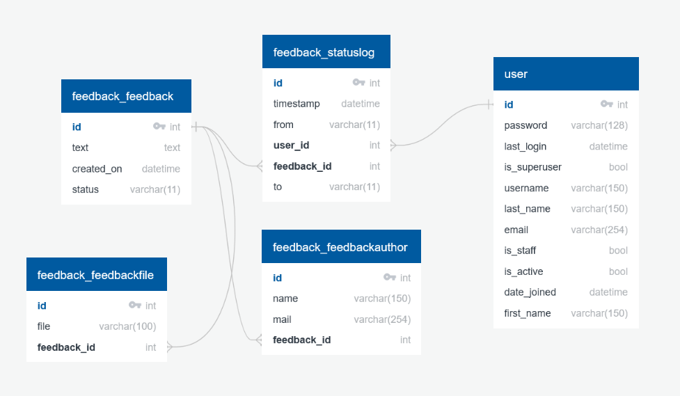
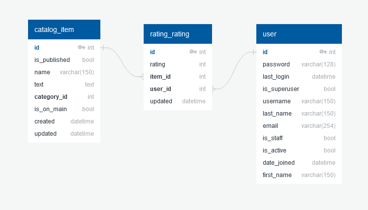

***Структура базы данных каталога описана в файле ER_catalog.jpg***

***Структура базы данных обратной связи описана в файле ER_feedback.jpg***

***Структура базы данных профиля пользователя описана в файле ER_profile.jpg***

***Структура базы данных рейтинга описана в файле ER_rating.jpg***

+ Для создания файлов перевода:\
***django-admin compilemessages***
+ Некоторые переменные должны быть сохранены в файл **.env**\
Для этого используем команду: ***cp .env.example .env***
+ Для Windows используем ***python (pip)***, для Linux - ***python3 (pip3)***
+ Чтобы стать администратором нужна команда:\
***python manage.py createsuperuser***\
После заполняем поля:
  + Имя пользователя (обязательно)
  + Адрес электронной почты (необязательно)
  + Пароль (обязательно)
+ Чтобы перейти к определённому товару, достаточно просто нажать на карточку товара

# Запуск сервера
1. Создать виртуальное окружение\
python -m venv venv (python3 -m venv .venv)
2. Активировать виртуальное окружение\
.venv\Scripts\activate (**source .venv/bin/activate** для Linux) 
3. Установить нужные библиотеки\
python -m pip install -r requirements\dev.txt \
(**python -m pip install -r requirements/dev.txt** для Linux)
4. Переходим в нужную директорию\
cd lyceum
5. Создаём базу данных (тестовой пока что нет >_<)\
python manage.py migrate
6. Загружаем fixtures\
python manage.py loaddata fixtures\data.json --app app.catalog \
(**python manage.py loaddata fixtures/data.json --app app.catalog** для Linux)
7. Запускаем сервер\
python manage.py runserver *(если нужно указываем нужный порт)*

# Запуск тестирования
1. Создать виртуальное окружение\
python -m venv .venv
2. Активировать виртуальное окружение\
.venv\Scripts\activate (**source .venv/bin/activate** для Linux) 
3. Установить нужные библиотеки\
python -m pip install -r requirements\dev.txt \
(**python -m pip install -r requirements/dev.txt** для Linux)
4. Переходим в нужную директорию\
cd lyceum
5. Запустить тесты\
python manage.py test 
6. Деактивировать виртуальное окружение (при необходимости)\
deactivate
