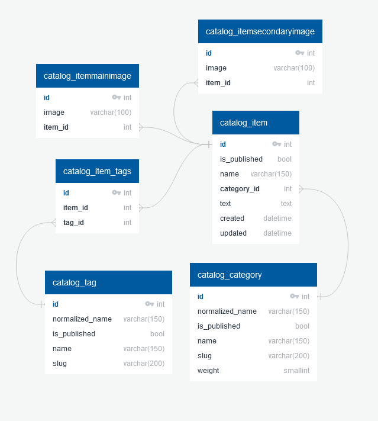

***Структура базы данных описана в файле ER.jpg***

+ Для создания файлов перевода:\
***django-admin compilemessages***
+ Некоторые переменные должны быть сохранены в файл **.env**\
Для этого используем команду: ***cp .env.example .env***
+ Для Windows используем ***python (pip)***, для Linux - ***python3 (pip3)***
+ Чтобы стать администратором нужна команда:\
***python manage.py createsuperuser***\
После заполняем поля:
  + Имя пользователя (обязательно)
  + Адрес электронной почты (необязательно)
  + Пароль (обязательно)

# Запуск сервера
1. Создать виртуальное окружение\
python -m venv venv (python3 -m venv venv)
2. Активировать виртуальное окружение\
venv\Scripts\activate (source .venv/bin/activate) 
3. Установить нужные библиотеки\
python -m pip install -r requirements\dev.txt
4. Переходим в нужную директорию\
cd lyceum
5. Создаём базу данных\
python manage.py migrate
6. Загружаем fixtures\
python manage.py loaddata fixtures/data.json --app app.catalog
7. Запускаем сервер\
python manage.py runserver *(если нужно указываем нужный порт)*

# Запуск тестирования
1. Создать виртуальное окружение\
python -m venv venv
2. Активировать виртуальное окружение\
venv\Scripts\activate
3. Установить нужные библиотеки\
python -m pip install -r requirements\dev.txt -r requirements\prod.txt
4. Переходим в нужную директорию\
cd lyceum
5. Запустить тесты\
python manage.py test 
6. Деактивировать виртуальное окружение (при необходимости)\
deactivate
