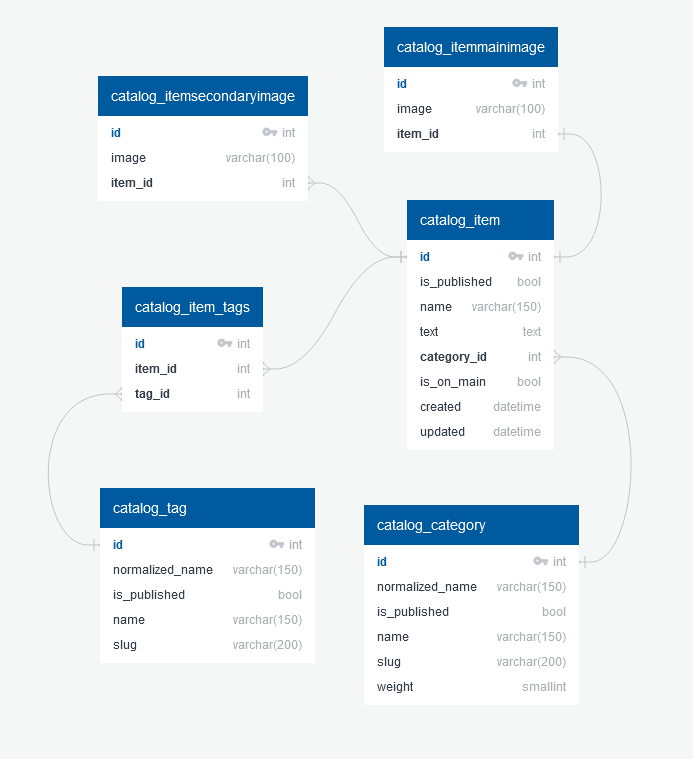
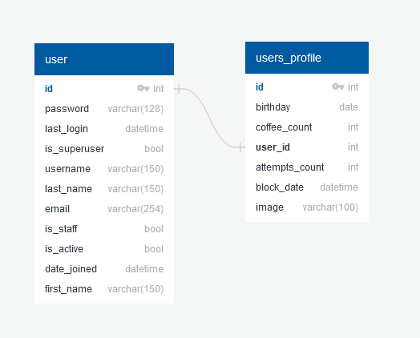

# Интернет магазин

+ Для Windows используем ***python (pip)***, для Linux - ***python3 (pip3)***
+ Чтобы перейти к определённому товару, достаточно просто нажать на карточку товара

## Запуск сервера

1. Создать виртуальное окружение\
python -m venv venv (python3 -m venv .venv)
2. Активировать виртуальное окружение\
.venv\Scripts\activate (**source .venv/bin/activate** для Linux)
3. Установить нужные библиотеки\
python -m pip install -r requirements\dev.txt \
(**python -m pip install -r requirements/dev.txt** для Linux)
4. Копируем переменные в файл окружения \
cp .env.example .env
5. Переходим в нужную директорию\
cd lyceum
6. Создаём базу данных (тестовой пока что нет >_<)\
python manage.py migrate
7. Загружаем fixtures\
python manage.py loaddata fixtures\data.json --app app.catalog \
(**python manage.py loaddata fixtures/data.json --app app.catalog** для Linux)
8. Создаём файлы перевода (если нужно) \
django-admin compilemessages
9. Создаём администратора (если нужно) \
python manage.py createsuperuser \
после заполняем нужные поля
10. Запускаем сервер\
python manage.py runserver *(если нужно указываем нужный порт)*

## Запуск тестирования

1. Создать виртуальное окружение\
python -m venv .venv
2. Активировать виртуальное окружение\
.venv\Scripts\activate (**source .venv/bin/activate** для Linux)
3. Установить нужные библиотеки\
python -m pip install -r requirements\dev.txt \
(**python -m pip install -r requirements/dev.txt** для Linux)
4. Переходим в нужную директорию\
cd lyceum
5. Запустить тесты\
python manage.py test
6. Деактивировать виртуальное окружение (при необходимости)\
deactivate

***Структура базы данных каталога описана в файле ER_catalog.jpg***

***Структура базы данных обратной связи описана в файле ER_feedback.jpg***

***Структура базы данных профиля пользователя описана в файле ER_profile.jpg***

***Структура базы данных рейтинга описана в файле ER_rating.jpg***

